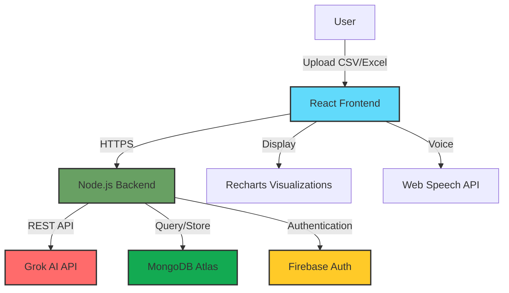

# 🚀 InsightAI - AI-Powered Business Intelligence Platform

<div align="center">


**Transform your business data into actionable insights with AI**

[](YOUR_RENDER_URL_HERE)
[](https://github.com/Druv12/insightai)
[](LICENSE)

[Live Demo](YOUR_RENDER_URL_HERE) • [Video Walkthrough](YOUR_VIDEO_URL_HERE) • [Report Bug](https://github.com/Druv12/insightai/issues) • [Request Feature](https://github.com/Druv12/insightai/issues)

</div>

---

## 📸 Screenshots

<div align="center">

### Dashboard Overview


### AI Analysis Report


### Interactive Charts


</div>

---

## 🎥 Demo Video

[](YOUR_VIDEO_URL_HERE)

**Watch the 3-minute demo to see InsightAI in action!**

---

## ✨ Features

### 🤖 **AI-Powered Analysis**
- **Intelligent Insights**: Automatically generates comprehensive business insights using Grok AI
- **Natural Language Understanding**: Ask questions about your data in plain English
- **Smart Recommendations**: Get actionable recommendations based on your data patterns

### 📊 **Advanced Visualizations**
- **12+ Chart Types**: Bar, Line, Pie, Area, Scatter, Radar, Composed, and more
- **Interactive Dashboards**: Fully responsive and interactive charts using Recharts
- **Customizable Views**: Select any 3 charts to display simultaneously
- **Real-time Updates**: Charts update instantly as you analyze different datasets

### 🎙️ **Voice Narration**
- **Text-to-Speech**: Listen to your analysis reports with natural voice playback
- **Playback Controls**: Play, pause, resume, and navigate through insights
- **Indian Number Format**: Properly reads lakhs, crores, and decimal points
- **Speed Control**: Adjust narration speed to your preference

### 📈 **Key Metrics Dashboard**
- **Revenue Analytics**: Total revenue, average order value, growth trends
- **Performance Metrics**: Conversion rates, customer lifetime value
- **Spend Analysis**: Budget utilization, cost breakdowns
- **Custom KPIs**: Define and track your own metrics

### 💾 **Data Management**
- **Multiple File Formats**: Support for CSV, Excel (XLSX, XLS), and more
- **Cloud Storage**: Secure data storage in MongoDB Atlas
- **Analysis History**: Access all your past analyses anytime
- **Data Comparison**: Compare multiple datasets side-by-side

### 🔐 **Security & Authentication**
- **Firebase Authentication**: Secure login/signup with email verification
- **User Isolation**: Each user's data is completely private and isolated
- **Session Management**: Secure JWT-based sessions
- **Password Reset**: Easy password recovery flow

### 🎯 **User Experience**
- **Responsive Design**: Perfect experience on desktop, tablet, and mobile
- **Dark Mode**: Eye-friendly interface for extended use
- **Fast Performance**: Optimized loading and rendering
- **Intuitive UI**: Clean, modern interface built with best UX practices

---

## 🏗️ Architecture

<div align="center">



</div>

### Data Flow
1. **User uploads** CSV/Excel file via React frontend
2. **Backend processes** file and extracts data
3. **Grok AI analyzes** data and generates insights
4. **MongoDB stores** analysis results and history
5. **Frontend displays** visualizations and insights
6. **User can replay** analysis with voice narration

---

## 🛠️ Tech Stack

### **Frontend**


### **Backend**


### **AI & APIs**


### **Authentication & Storage**


### **Deployment & DevOps**


### **Libraries & Tools**
- **PapaParse**: CSV parsing
- **SheetJS**: Excel file processing
- **Axios**: HTTP client
- **CORS**: Cross-origin resource sharing
- **dotenv**: Environment configuration

---

## 🚀 Getting Started

### Prerequisites
- Node.js 18.x or higher
- npm or yarn
- MongoDB Atlas account
- Firebase project
- Grok API key

### Installation

1. **Clone the repository**
```bash
git clone https://github.com/Druv12/insightai.git
cd insightai
```

2. **Install backend dependencies**
```bash
cd backend
npm install
```

3. **Install frontend dependencies**
```bash
cd ../frontend
npm install
```

4. **Configure environment variables**

Create `.env` file in the `backend` directory:
```env
PORT=5000
MONGODB_URI=your_mongodb_atlas_uri
GROK_API_KEY=your_grok_api_key
FIREBASE_API_KEY=your_firebase_api_key
NODE_ENV=development
```

Create `.env` file in the `frontend` directory:
```env
REACT_APP_API_URL=http://localhost:5000
REACT_APP_FIREBASE_API_KEY=your_firebase_api_key
REACT_APP_FIREBASE_AUTH_DOMAIN=your_firebase_auth_domain
REACT_APP_FIREBASE_PROJECT_ID=your_firebase_project_id
```

5. **Start the backend server**
```bash
cd backend
npm start
```

6. **Start the frontend development server**
```bash
cd frontend
npm start
```

7. **Open your browser**
Navigate to `http://localhost:3000`

---

## 📖 Usage Guide

### 1️⃣ **Sign Up / Login**
- Create a new account or login with existing credentials
- Email verification ensures account security

### 2️⃣ **Upload Your Data**
- Click "Upload CSV/Excel" button
- Select your business data file
- Supported formats: CSV, XLSX, XLS

### 3️⃣ **AI Analysis**
- InsightAI automatically analyzes your data
- View comprehensive insights and recommendations
- See key metrics and trends

### 4️⃣ **Visualize Data**
- Select from 12+ chart types
- Choose any 3 charts to display
- Interact with charts for detailed information

### 5️⃣ **Voice Playback**
- Click "Play Analysis" to hear insights
- Use playback controls (play, pause, resume)
- Navigate through different sections

### 6️⃣ **Ask Questions**
- Type natural language questions about your data
- Get instant AI-powered answers
- Save important insights

### 7️⃣ **View History**
- Access all past analyses
- Compare different time periods
- Reload previous datasets

---

## 📊 Use Cases

### 🛒 **E-commerce Analytics**
- Track sales performance and revenue trends
- Analyze customer behavior patterns
- Monitor conversion rates and cart abandonment
- Optimize pricing strategies

### 💼 **Marketing Campaign Analysis**
- Measure campaign ROI and effectiveness
- Track ad spend vs. revenue generated
- Identify high-performing channels
- Optimize budget allocation

### 📈 **Financial Planning**
- Monitor cash flow and expenses
- Forecast future revenue
- Identify cost-saving opportunities
- Track budget utilization

### 🏢 **Business Operations**
- Analyze operational efficiency
- Track KPIs and performance metrics
- Identify bottlenecks and inefficiencies
- Monitor team productivity

---

## 🎯 Roadmap

### Phase 1: Core Features ✅ (Completed)
- [x] AI-powered analysis
- [x] Interactive visualizations
- [x] Voice narration
- [x] User authentication
- [x] Cloud storage
- [x] Analysis history

### Phase 2: Advanced Analytics 🚧 (In Progress)
- [ ] Predictive forecasting (next 3 months)
- [ ] Anomaly detection with alerts
- [ ] Correlation analysis
- [ ] Comparative analysis (period-over-period)
- [ ] Custom dashboard builder

### Phase 3: Enhanced Features 📋 (Planned)
- [ ] PDF report export
- [ ] Email scheduled reports
- [ ] Team collaboration
- [ ] API access for developers
- [ ] Mobile app (iOS/Android)
- [ ] Integration with Google Sheets, Excel Online

### Phase 4: Enterprise Features 💡 (Future)
- [ ] Multi-user workspaces
- [ ] Role-based access control
- [ ] Custom branding
- [ ] Advanced security features
- [ ] Dedicated support

---

## 🤝 Contributing

Contributions are welcome! Here's how you can help:

1. Fork the repository
2. Create a feature branch (`git checkout -b feature/AmazingFeature`)
3. Commit your changes (`git commit -m 'Add some AmazingFeature'`)
4. Push to the branch (`git push origin feature/AmazingFeature`)
5. Open a Pull Request

Please read [CONTRIBUTING.md](CONTRIBUTING.md) for details on our code of conduct and development process.

---

## 🐛 Bug Reports & Feature Requests

Found a bug? Have a feature idea? Please [open an issue](https://github.com/Druv12/insightai/issues) with:

**For Bugs:**
- Clear description of the issue
- Steps to reproduce
- Expected vs actual behavior
- Screenshots if applicable
- Your environment (OS, browser, versions)

**For Features:**
- Clear description of the feature
- Use case and benefits
- Any implementation ideas

---

## 📄 License

This project is licensed under the MIT License - see the [LICENSE](LICENSE) file for details.

---

## 👨‍💻 Author

**Druv**
- GitHub: [@Druv12](https://github.com/Druv12)
- LinkedIn: [Your LinkedIn](YOUR_LINKEDIN_URL)
- Portfolio: [Your Portfolio](YOUR_PORTFOLIO_URL)
- Email: your.email@example.com

---

## 🙏 Acknowledgments

- [Grok AI](https://grok.x.ai/) for powerful AI analysis
- [Recharts](https://recharts.org/) for beautiful visualizations
- [Firebase](https://firebase.google.com/) for authentication
- [MongoDB Atlas](https://www.mongodb.com/atlas) for cloud database
- [Render](https://render.com/) for seamless deployment

---

## ⭐ Show Your Support

If you find InsightAI useful, please consider:
- Giving it a ⭐ on GitHub
- Sharing it with others
- Contributing to the project
- Reporting bugs and suggesting features

---

<div align="center">

**Made with ❤️ by Druv**

[⬆ Back to Top](#-insightai---ai-powered-business-intelligence-platform)

</div>
